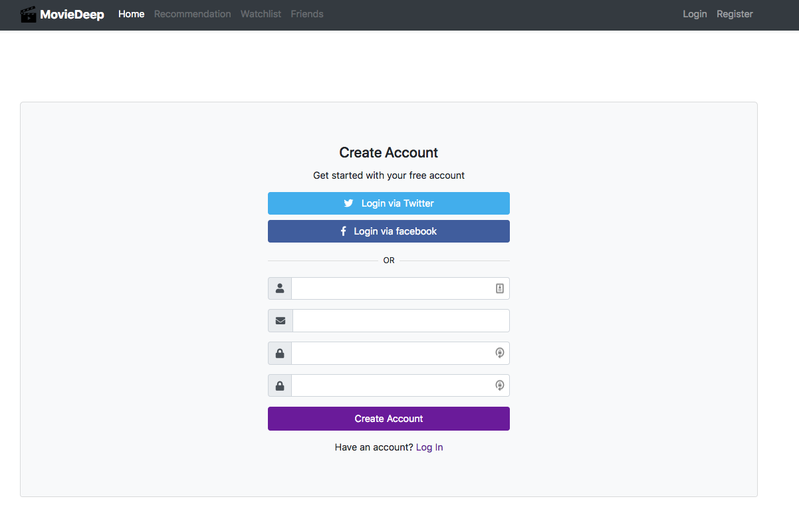
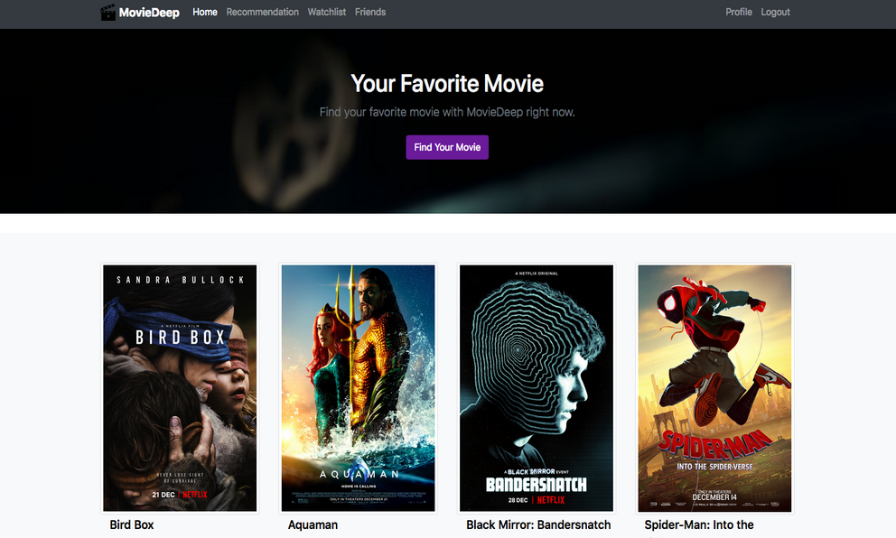
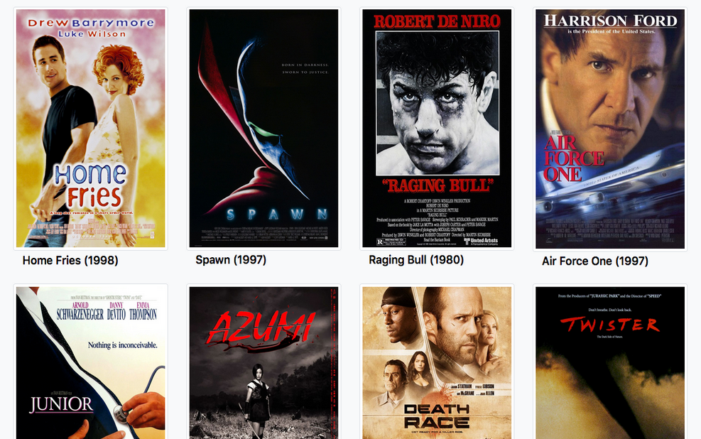
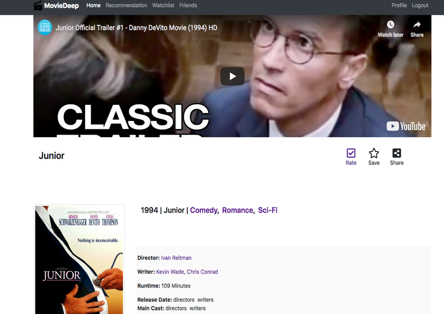
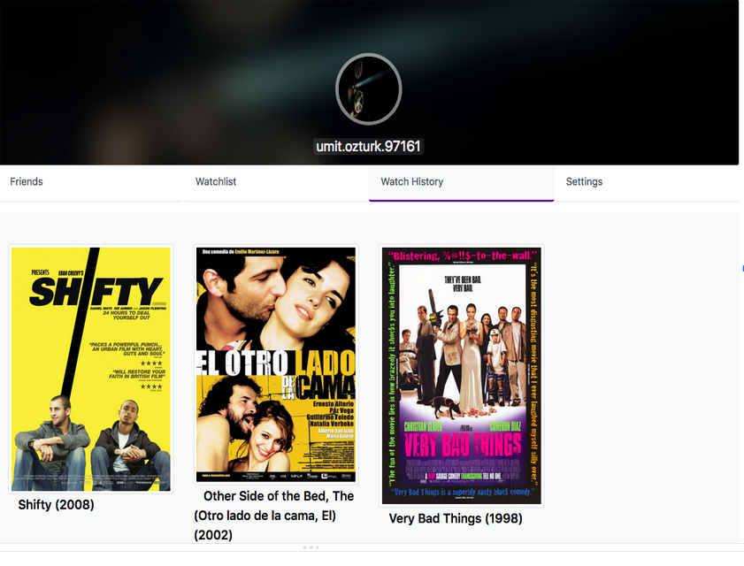

# MovieDeep

    
MovieDeep is a movie social media platform that based on deep learning. Through the recommendation engine, it recommends you the movies you might like. This way, you wouldn’t watch bad movies. You can also follow popular and current movies and share them with your friends. 

With MovieDeep, you can create your own watch list and keep track of the movies that you have seen. If your friends wants a movie advice from you, you can easily filter the list of the movies you have seen and recommend the movie that you like the most to your friends.

MovieDeep is my Final Project at Namik Kemal University.
#####You don't use at production. Because I have stopped development.   

<table><tr><td align="center"><a href="https://github.com/umit-ozturk">  <b>Ümit Öztürk</b></a> </td></tr></table>  

## Installation
Clone the repository and create a virtual environment.

    $ git clone https://github.com/umit-ozturk/MovieDeep.git
	$ cd MovieDeep
	$ virtualenv -p python3 env
	$ source env/bin/activate
    $ pip install -r requirements.txt

## Create superuser

    $ python manage.py createsuperuser
    
## Run Server
    
    $ python manage.py runserver

## How to use MovieDeep?
First, register to MovieDeep. Click the “Find My Movie” button on the homepage. Rate the movies that you watch. Our recommended engine finds movies that you can love.

Save movies that you watched and want to watch. Keep up with current and popular movies.

## How to work MovieDeep?
MovieDeep uses Movielens Dataset. It save the films information in the dataset to own django model. Also Creates the unique slug. 

When you rate a movie, MovieDeep saves and predicts the movie. Also It prepare movie detail page.

## Which technologies have I used?

## Screenshots

